# Cloud Run Instances demo
This demo allows you to visualise the lifecycle events that take place during the lifetime of a CloudRun service running an http server. 
We will run 2 simple Http webservers, connected by a pub/sub topic.
The first server called **HelloAPI** responds to user requests will a *hello* response.
It publishes its status as messages to a pubsub topic.
The second server called **Visualizer** will consume the events from the pubsub topic and visualise them on a webpage.

<figure>
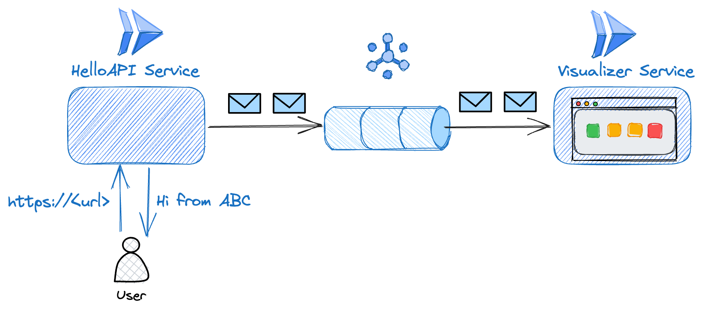
    <figcaption>The cloudrun HelloAPI service sends messages via pubsub to the Visualizer service.</figcaption>
</figure>

----

## Features
The **Visualizer** service visually renders the following characteristics of the **HelloAPI** service
### Instances that are serving HelloAPI requests
Based on the amount of traffic the HelloAPI recieves, CloudRun will scale up and scale down the instances. The **Visualizer** service visualizes the CloudRun instances that are a part of the *HelloAPI* service.
<figure>
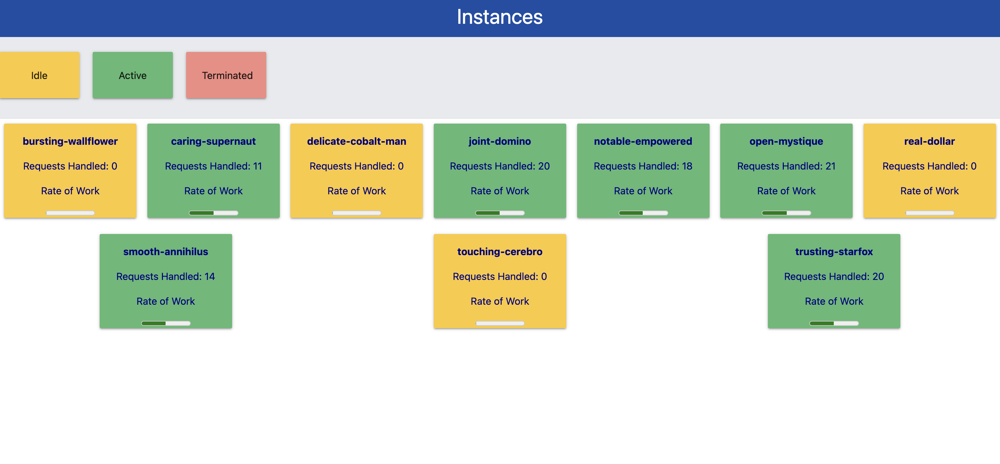
    <figcaption>The Visualizer displays the status of each of the HelloAPI instances.</figcaption>
</figure>

### The status of the HelloAPI instances 
Instances may be in the following states:
*Visualizer* service shows the following statuses that an *HelloAPI* instance may be in.

1. Actively processing Requests: These instances are depicted by the colour *green*. This means that the instances is actively processing user request(s).

<figure>
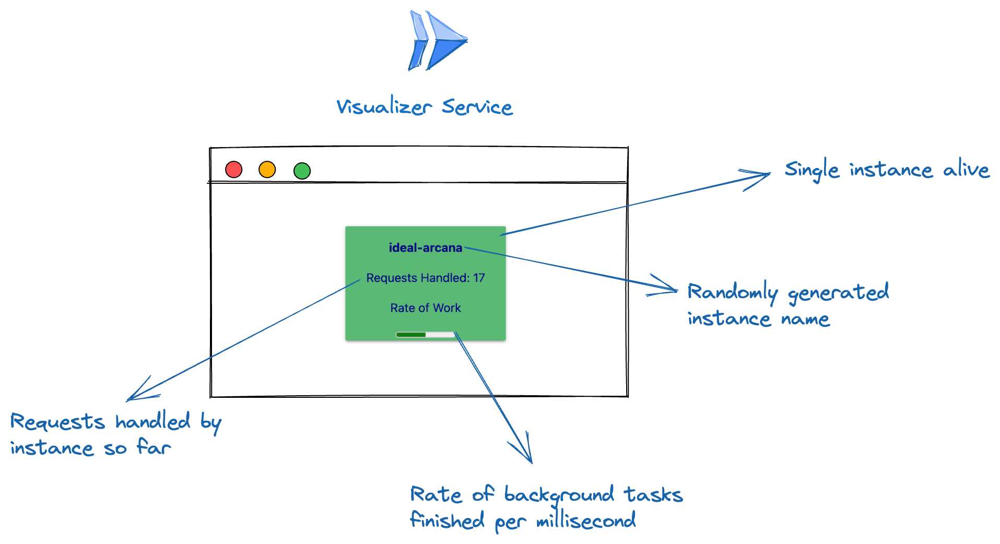
    <figcaption>This instance is actively processing requests.</figcaption>
</figure>

2. Idle: These instances are depicted by the colour *yellow*. This means that the instances is are alive, but no requests are currently being processed.

<figure>
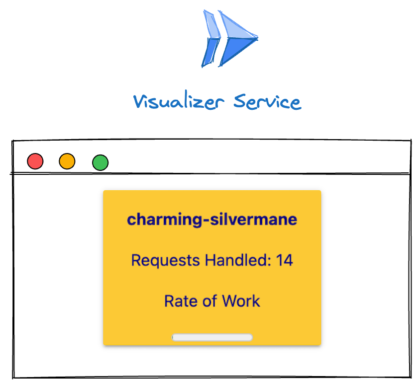
    <figcaption>This instance is currently processing no requests.</figcaption>
</figure>

3. Killed: These instances are depicted by the colour *red*. These instances have recieved a *terminate* signal from CloudRun, and are either also already terminated or in the process of terminating. The *Visualizer* displays them for a few minutes and will evenutally remove them from the screen.

<figure>
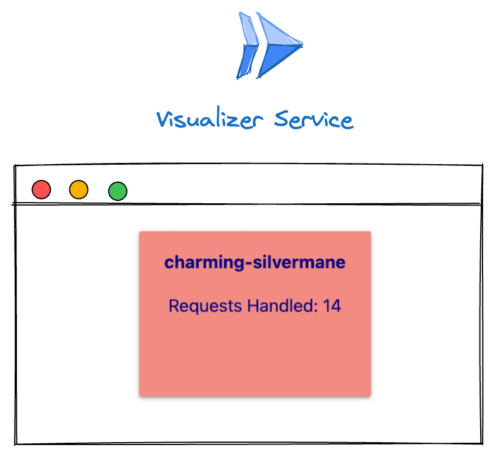
    <figcaption>This instance is terminated or is in the process of terminating.</figcaption>
</figure>

### The allocated CPU level of HelloAPI instances 
In CloudRun, by default, instances that are not serving requests have their CPU throttled. While this demo doesn't show you the available CPU, it uses the **rate of work** being performed by a HelloAPI instance (in the background) and uses this value to show the change in CPU allocation. When CPU is not throttled, the *rate of work* performed will be higher than when CPU is throttled. 
The *HelloAPI* instance performs a constant background task which is computing SHA512 hashes for a string. The *rate of work* is the average number of hashes computed per millisecond. This value will be higher when the CPU is unthrottled, compared to when it is.

<figure>
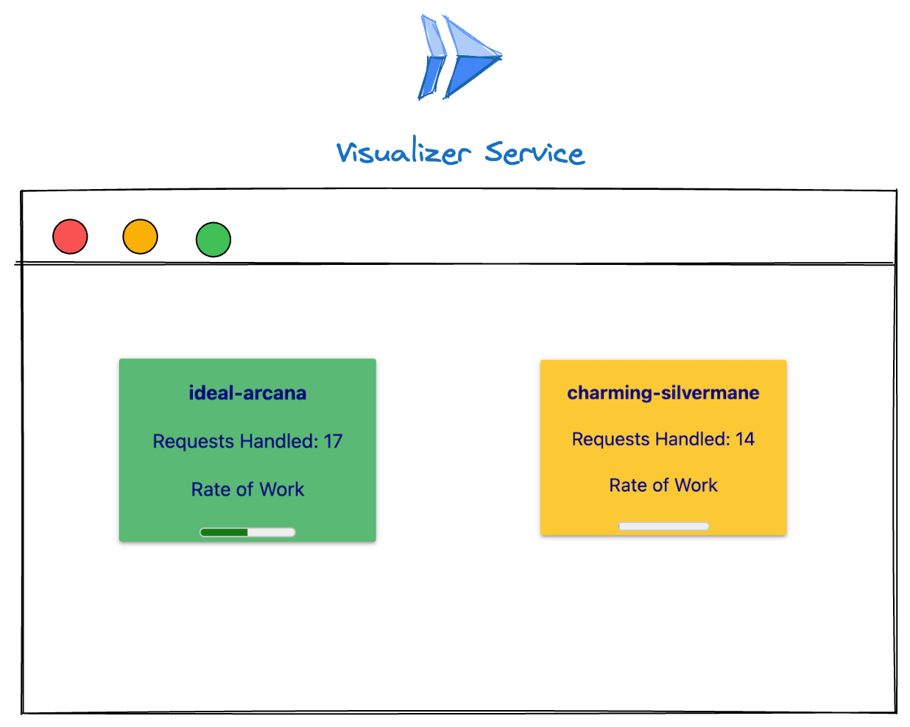
    <figcaption>The Active instance has a higher rate of work than the Throttled (idle) instance.</figcaption>
</figure>


## How to run this demo

This demo is designed to run on Google Cloud Platform. You will be paying for the resources you consume during the demo.
The demo uses cloudbuild to build the images and terraform to deploy the necessary infrastructure. The demo assumes the user has the required knowledge to use terraform.
The easiest way to run the demo is by cloning the repo locally. 

----

### Set up the demo
0. Clone this repo and navigate to the folder with the code.

1. Create a project in Google Cloud. You can use an existing one if you like.
Set that as your active project in gcloud.
    ```sh
        gcloud config set project <PROJECT_NAME>
    ```

2. Enable the required APIs.
    ```sh
    gcloud services enable \
    artifactregistry.googleapis.com \
    cloudbuild.googleapis.com \
    iam.googleapis.com \
    run.googleapis.com \
    pubsub.googleapis.com \
    cloudresourcemanager.googleapis.com
    ```

3. Create an artifact registry in your project for the images that we will build and publish in the next step.
    ```sh
    gcloud artifacts repositories create <REPO_NAME> \
        --repository-format=docker \
        --location=<LOCATION>
    ```

4. Build and publish the container images for the HelloAPI and the Visualizer.
    ```sh
    gcloud builds submit . \
    --substitutions=_REGION=<LOCATION>,\
    _PROJECT_ID=<PROJECT_ID>,\
    _REPOSITORY=<REPO_NAME> 
    ```
    There should be two images called visualizer and helloapi in your GCP Artifact Registry.
    <figure>
    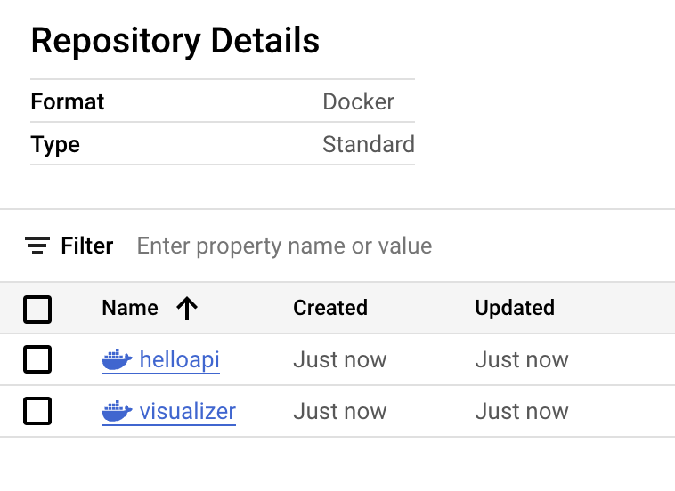
    <figcaption> Your repo in artifact registry should show two images </figcaption>
    </figure>

5. Now, it is time to provision infrastructure using terraform. You can either setup remote state handling or local state handling. For simplicity, this demo stores state locally. Make sure you give terraform the right credentials to be able to create resources and service accounts on your behalf. Check [here](https://registry.terraform.io/providers/hashicorp/google/latest/docs/guides/provider_reference#running-terraform-on-your-workstation) for instructions.

6. Navigate to the terraform folder.
    ```sh
    cd terraform
    ```
7. Look at the **variables.tf** file. Ensure you know what values you want to provide these variables. 
    The **response_delay_interval** variable adds an artificial delay between the user request and the API response. This is to allow more time for the user to see an *Active* instance in the visualizer. As when the traffic is low, instances will change from Idle->Active->Idle before you can see them.

8. Run terraform init.
    ```sh
    terraform init
    ```
9. Run terraform apply
    ```sh
    terraform apply 
    ```
    You will be asked to supply your values for each of the variables. Once this is done, terraform will display a plan that it will ask you to confirm. If you are satisfied with the plan, allow terraform to create the infrastructure.
----
### Play with the demo

1. Go to the CloudRun services page. This page should show the two newly created services, the *HelloAPI* and *Visualizer*

    <figure>
        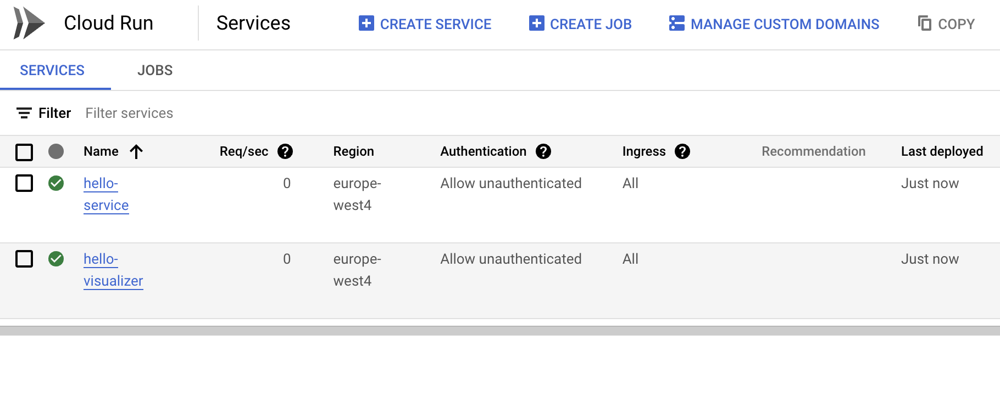
        <figcaption>Your CloudRun Services page should show the two new services.</figcaption>
    </figure>


2. Note down their URLs from the ServiceDetails page for both services respectively. It will look something like *https://hello-service-########-ez.a.run.app* and *https://hello-visualizer-########-ez.a.run.app/*


3. Navigate to the *Visualizer* from your browser. You should see the instances of the *HelloAPI* service. If you haven't sent any requests, there should be one instance alive and idle.

4. Start sending requests to the *HelloAPI*. You can use the web browser, or you could curl it.

```sh
curl https://hello-service-abcdefgh-ez.a.run.app
```

<figure>
    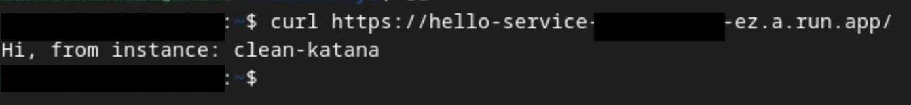
    <figcaption>The service will return a Hello response after pre-set delay period is finished.</figcaption>
</figure>


5. Using a load generation tool like [siege](https://linux.die.net/man/1/siege) will allow you to send a lot of requests to the HelloAPI, this will show many more instances being created. 

```sh
siege -q -t10s -c20 https://hello-service-abcdefgh-ez.a.run.app
```

6. Observe the instances scaling out, handling requests, becoming idle and getting terminated.

<figure>
    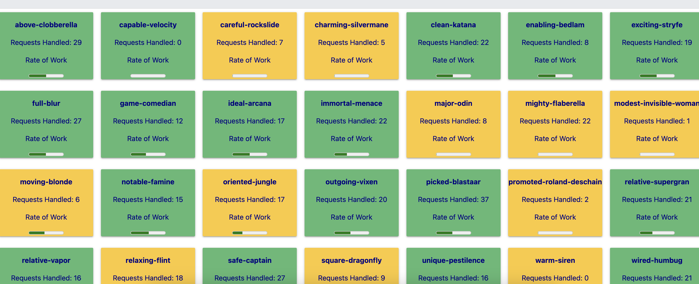
    <figcaption>Instances will start scaling out and handling the large amount of traffic. You will notice active instances performing more (background) tasks than idle instances.</figcaption>
</figure>

<figure>
    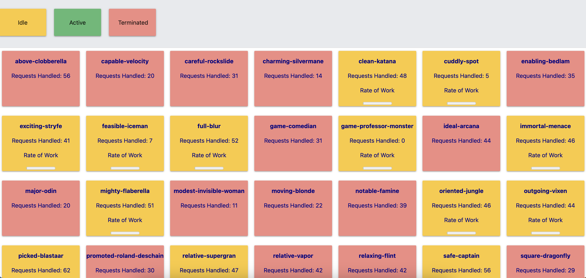
    <figcaption>Instances will start going idle or getting terminated after traffic stops. Idle instances perform far fewer (background) tasks for a set interval.</figcaption>
</figure>

----
### Play with the demo

You can delete the demo once you are finished, and redeploy it whenever you want using terraform.
To destroy, run the following command
```sh
terraform destroy
```
Confirm when prompted.